# Multi-Session Memory System - Architecture Diagrams

This document contains visual representations of the Multi-Session Memory System architecture using Mermaid diagrams.

---

## 1. System Architecture Overview

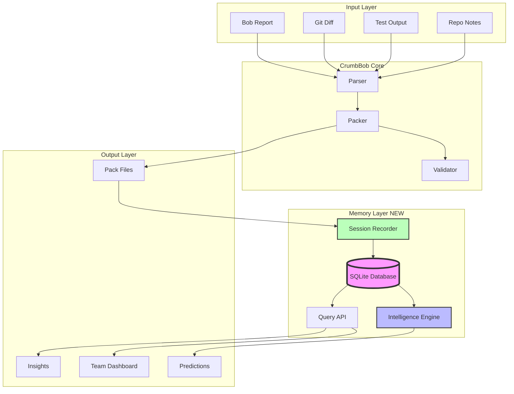

---

## 2. Database Schema Relationships

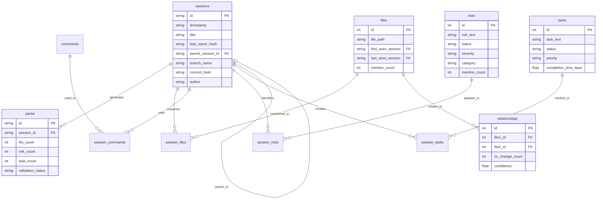

---

## 3. Data Flow: Recording a Session

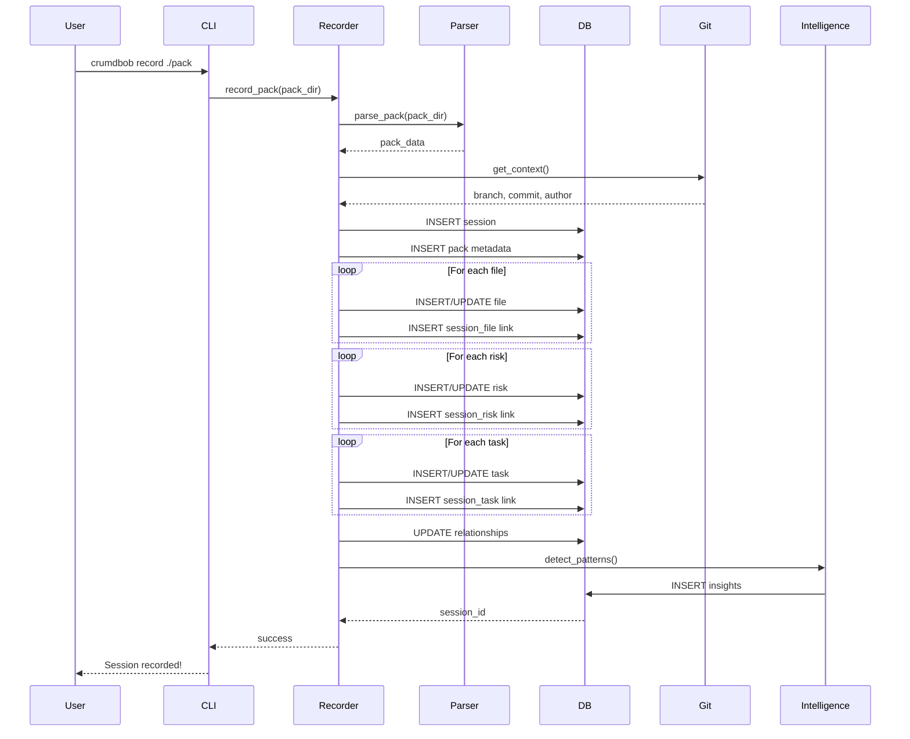

---

## 4. Query Processing Flow

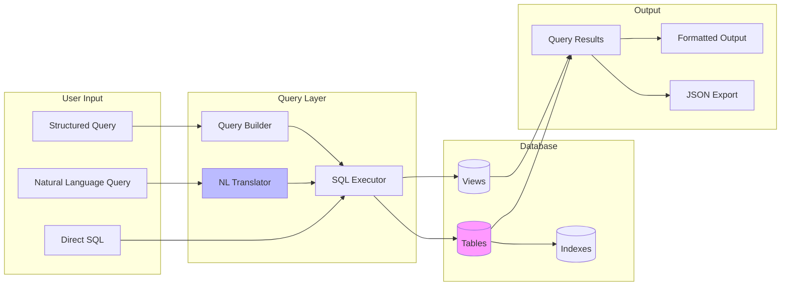

---

## 5. Intelligence Engine Architecture

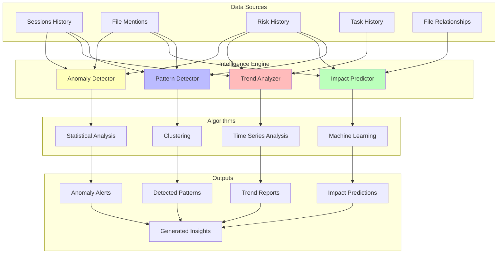

---

## 6. Team Collaboration Flow

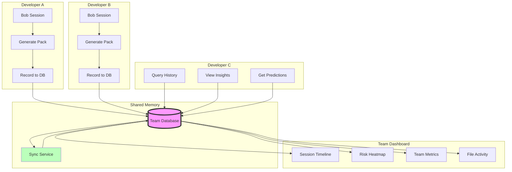

---

## 7. Integration Points

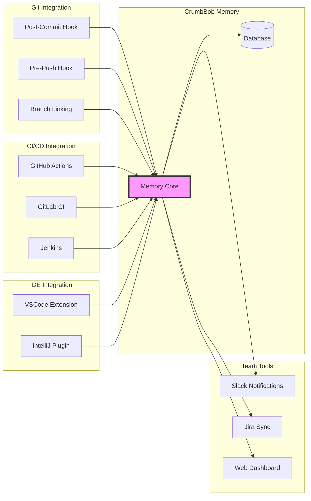

---

## 8. Impact Prediction Process

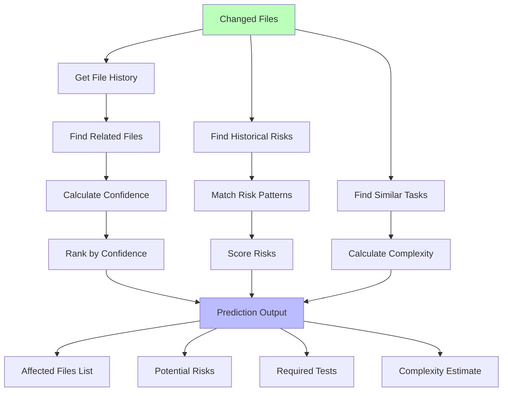

---

## 9. Session Timeline Visualization

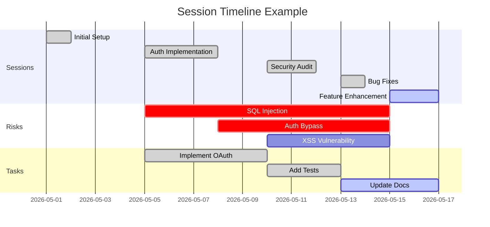

---

## 10. Risk Evolution Tracking

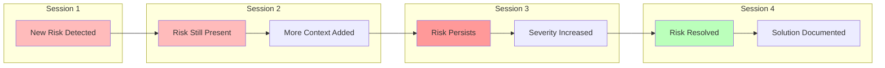

---

## 11. File Relationship Network

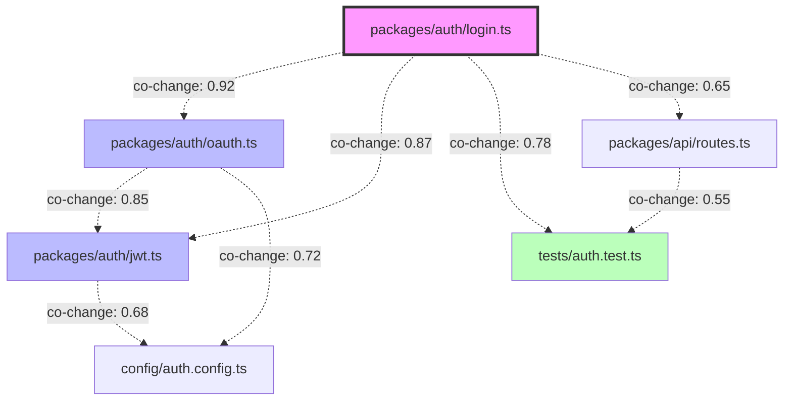

---

## 12. Migration Strategy

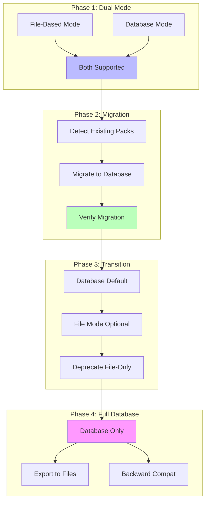

---

## 13. Performance Optimization Strategy

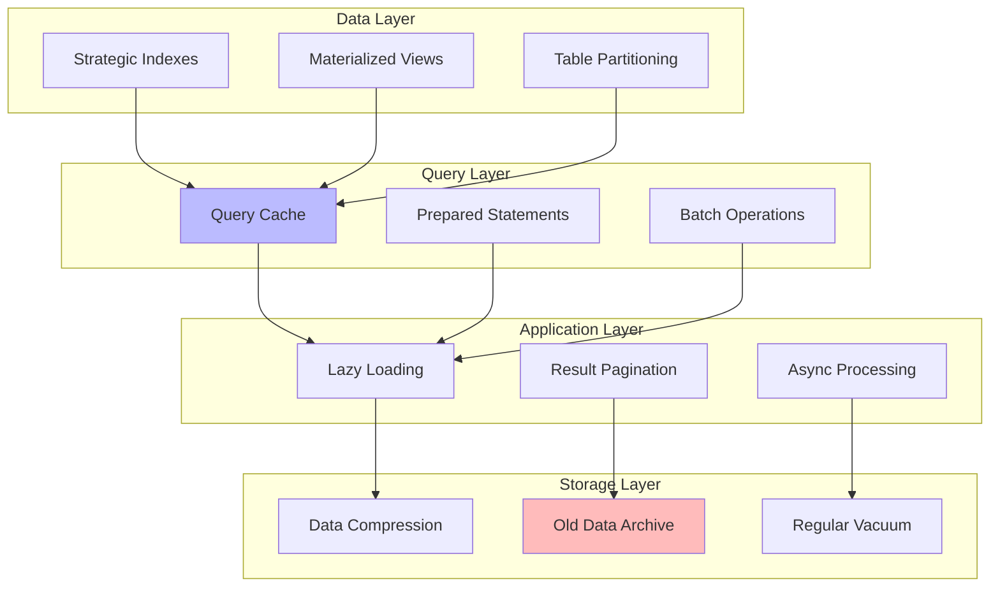

---

## Summary

These diagrams illustrate the complete Multi-Session Memory System architecture:

1. **System Architecture**: Overall component structure
2. **Database Schema**: Entity relationships and data model
3. **Data Flow**: How sessions are recorded
4. **Query Processing**: How queries are executed
5. **Intelligence Engine**: Pattern detection and prediction
6. **Team Collaboration**: Multi-user workflows
7. **Integration Points**: External system connections
8. **Impact Prediction**: Prediction algorithm flow
9. **Session Timeline**: Temporal visualization
10. **Risk Evolution**: How risks are tracked over time
11. **File Relationships**: Co-change network
12. **Migration Strategy**: Transition from file-based to database
13. **Performance**: Optimization strategies

These diagrams can be rendered in any Mermaid-compatible viewer or documentation system.